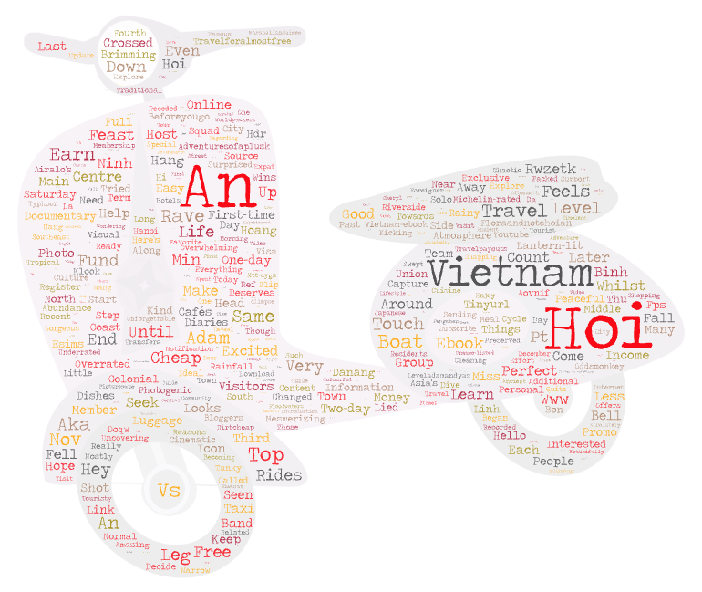

# GEOG458-Lab-2-Web-data-collection-and-word-clouds

Please create a narrative based on your research. In your narrative, please describe
- topic
- parameters for search (5 PTS)
  
- why do you want to make this comparison (5 PTS)
- compare the word clouds and discuss the difference or similarity among the word clouds (5 PTS)
- what might be the possible reasons for the patterns you observed (5 PTS)

- how your research could be improved in the future (5 PTS)
  
- anything you find from the map or data that is different from your expectation before the exercise, or anything that stands out to you (5 PTS)

# Word Cloud 1

[Download the CSV](search-result-1.csv)

# World Cloud 2

[Download the CSV](search-result-2.csv)

